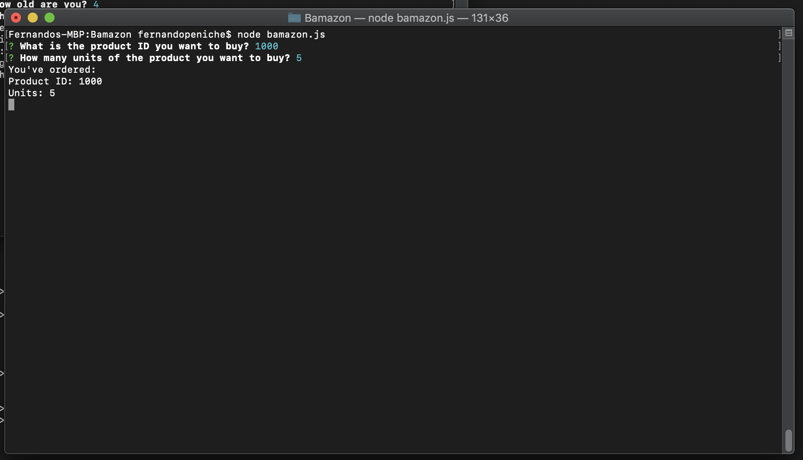

# Bamazon

This is the node app called **Bamazon** to buy products and keep, in the **SQL Database**, the stock up-to-date at all times.

First, we display, by calling the **SQL Bamazon Database**, the entire stock of items with names and descriptions, see below:

Secondly, we capture, through **Inquirer Prompts**, the inputs from the user, see below:

As a third step, we connect to the **SQL Bamazon DB** again, and, based on the purchases from the users, we maintain the stock on hand up-to-date. 
In this case, I got a challenge connecting to the DB, find my code in the repo [My repo in Github!](https://github.com/fpeniche/Bamazon). 

For some reason, the app stops once I capture the prompts from the user, as seen in image above, and didn't connect to the DB as the next step. See the functions with SQL scripts I plan to run:

Function to buy the product

Function to update stock

And, my DB connection

